# Multimodal Product Matching & Retrieval System

Find duplicate and near-duplicate marketplace listings using **both the product
image and the product title**. The system uses pretrained CLIP and Sentence-Transformer
encoders, projection heads, weighted fusion, FAISS vector search, and
leakage-safe evaluation. It includes a FastAPI service, a Streamlit demo and
an optional metric-learning module.

> The architecture is **inspired by** multimodal marketplace matching problems such
> as the Shopee Price Match Guarantee competition. It is an independent,
> lightweight implementation. It does **not** reproduce any competition solution
> and makes no leaderboard claims. It is not affiliated with Shopify Inc.; the
> repository name is only the project folder name.

  

---

## Contents

1. [Problem statement](#problem-statement)
2. [Architecture](#architecture)
   - [System overview](#1-system-overview) · [Offline build](#2-offline-build-pipeline) · [Model](#3-model-architecture) · [Search path](#4-online-query-path-search) · [Match path](#5-online-query-path-match) · [Scoring](#6-scoring)
   - [Evaluation](#7-evaluation-pipeline) · [Training](#8-optional-training-pipeline) · [Code layering](#9-code-layering) · [Artifact contracts](#10-artifact-contracts-and-consistency) · [Configuration](#11-configuration-map) · [Failure handling](#12-failure-handling)
3. [Design decisions (the "why")](#design-decisions)
4. [Dataset format](#dataset-format)
5. [Installation](#installation)
6. [Running locally](#running-locally)
7. [API examples](#api-examples)
8. [Evaluation methodology](#evaluation-methodology)
9. [Results & ablation study](#results--ablation-study)
10. [Optional: metric learning](#optional-metric-learning)
11. [Project structure](#project-structure)
12. [Screenshots](#screenshots)
13. [Limitations](#limitations)
14. [Future improvements](#future-improvements)

---

## Problem statement

On a marketplace, many sellers list the **same product** with different photos
(backgrounds, angles, promo badges) and different titles ("Nordwave Cotton Tee Red M"
vs. "[PROMO] T Shirt Nordwave Red free shipping"). Grouping these listings powers
price comparison, catalog deduplication and search.

Given a product (image and/or title), the system:

- retrieves the **Top-K most similar catalog products** (image-only, text-only or multimodal),
- scores **image, text and combined similarity** for any pair of products,
- makes a **MATCH / NOT_MATCH** decision with a configurable threshold,
- is evaluated with **Recall@K, Precision@K, mAP, pairwise Precision/Recall/F1/Accuracy**,
  threshold sweeps and an ablation study.

### Why multimodal matching?

Each modality fails in its own way:

| Signal | Strength | Typical failure |
|---|---|---|
| Image | robust to title noise, language, spelling | colour/style variants of one model look alike; different photos of the same item can look different |
| Title | brand, model code, capacity, colour words | titles are noisy, and colour variants differ by one token |

This shows up in the sample data (notebook 03): image and text similarity
correlate only moderately (r ≈ 0.50 over all pairs), so they carry partly
independent evidence. Fusion combines both.

---

## Architecture

The system has two halves that share one set of artifacts. An **offline build
pipeline** turns a product catalog into embeddings and FAISS indexes. An
**online serving layer** (FastAPI and Streamlit) loads those artifacts once and
answers search and match queries. Evaluation and the optional training module
read the same cached embeddings, so nothing is ever re-encoded just to measure it.

### 1. System overview

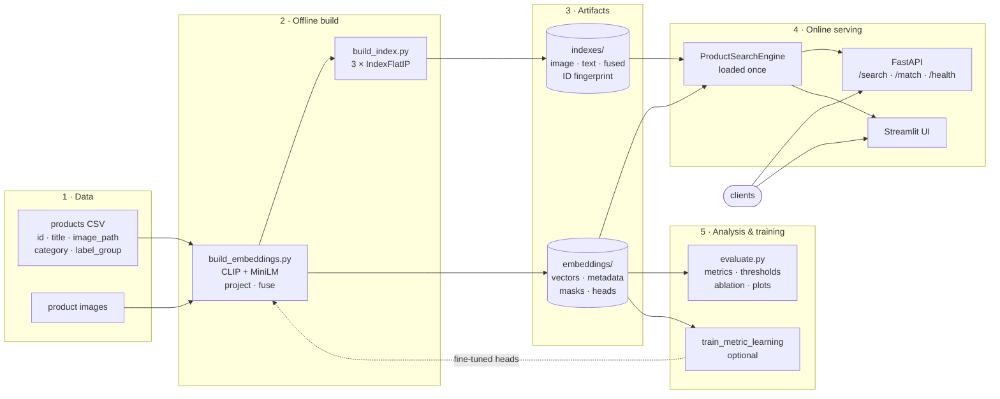

`configs/config.yaml` drives every stage: models, fusion weights, thresholds,
top-k, split strategy and paths. See the [configuration map](#11-configuration-map).

### 2. Offline build pipeline

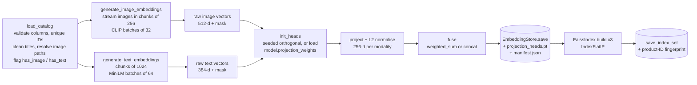

| Step | Code | Output |
|---|---|---|
| Validate and clean catalog | `src/data/dataset.py`, `src/data/preprocessing.py` | DataFrame with `clean_title`, `image_file`, `has_image`, `has_text` |
| Encode images | `src/embeddings/generate_image_embeddings.py` → `src/models/image_encoder.py` | `image_raw.npy` (n × 512) |
| Encode titles | `src/embeddings/generate_text_embeddings.py` → `src/models/text_encoder.py` | `text_raw.npy` (n × 384) |
| Project and fuse | `src/models/multimodal_encoder.py`, `src/embeddings/fusion.py` | `image.npy`, `text.npy`, `fused.npy` (n × 256) |
| Persist | `src/embeddings/store.py` | `metadata.csv`, `masks.npz`, `manifest.json`, `projection_heads.pt` |
| Index | `src/retrieval/faiss_index.py` | `{image,text,fused}.faiss` + `manifest.json` |

Raw backbone vectors are stored too. That lets the training module and fusion
ablations reuse them without running CLIP or MiniLM again.

### 3. Model architecture

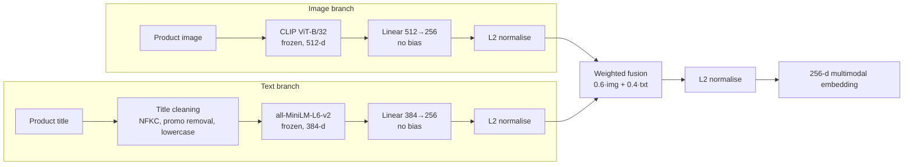

| Stage | Component | Output |
|---|---|---|
| Image encoder | `openai/clip-vit-base-patch32` (frozen) | 512-d, L2-normalised |
| Text encoder | `sentence-transformers/all-MiniLM-L6-v2` (frozen) | 384-d, L2-normalised |
| Projection heads | bias-free `Linear(in, 256)` + L2 norm, one per modality | 256-d each |
| Fusion | `normalize(w_i·img + w_t·txt)`, `w_i=0.6`, `w_t=0.4` (configurable) | 256-d |

**Projection heads without training.** A randomly initialised linear layer would
scramble the backbones' similarity structure. The heads are therefore initialised
as a **seeded semi-orthogonal matrix**, which approximately preserves inner
products. On the sample catalog, pairwise cosine similarities before (512-d) and
after (256-d) projection correlate at **r = 0.978** (notebook 02), so the baseline
works with zero training. The optional metric-learning module fine-tunes exactly
these heads.

**Missing data.** A missing or unreadable image, or an empty title, yields a zero
vector and a mask. Fusion and scoring then use only the modalities that are
available, re-normalising the weights. Nothing crashes, and a product with only
a title can still be matched.

### 4. Online query path: search

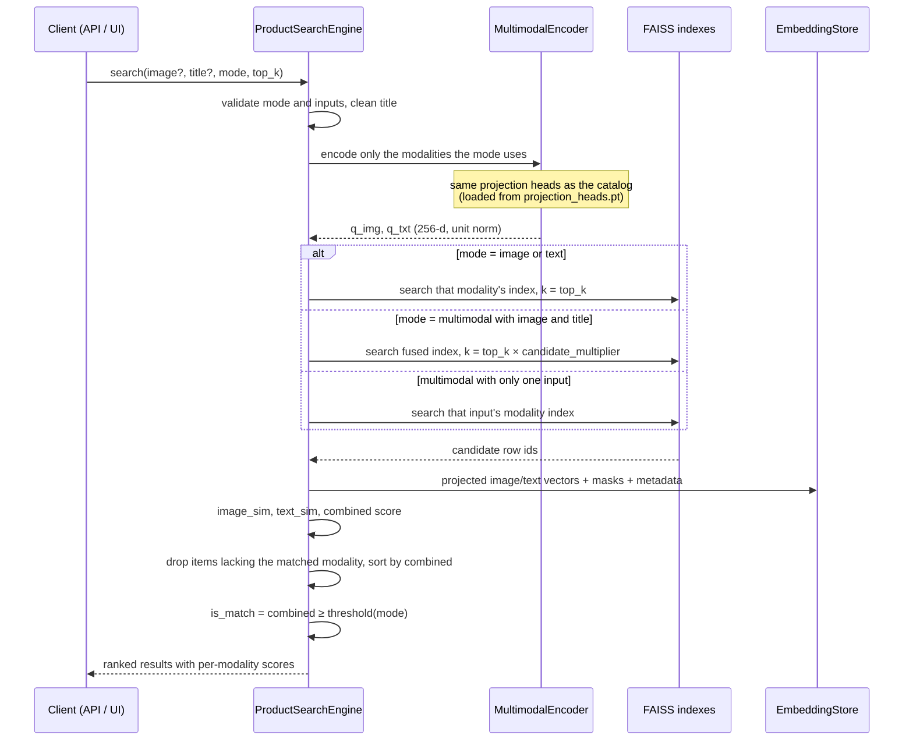

### 5. Online query path: match

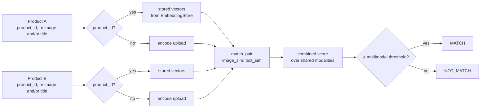

### 6. Scoring

All vectors are unit length, so every similarity is a cosine similarity:

```text
image_similarity    = img_A · img_B
text_similarity     = txt_A · txt_B
combined_similarity = (w_i·[img shared]·image_similarity + w_t·[txt shared]·text_similarity)
                      / (w_i·[img shared] + w_t·[txt shared])
decision            = MATCH if combined_similarity ≥ threshold(mode) else NOT_MATCH
```

`[img shared]` is 1 when both products have an image, otherwise 0; the same
holds for titles. With both modalities present this reduces to
`0.6·image_similarity + 0.4·text_similarity`. Mode-specific thresholds come from
`matching.mode_thresholds` and fall back to `matching.threshold`.

The fused index is used only for **candidate generation**. Its inner product,
`normalize(w_i·img + w_t·txt)` against the same for the other product, also
contains cross-modal terms (`img_A·txt_B`, `txt_A·img_B`). So candidates are
re-ranked by the explicit combined score above, which is the score the matcher
thresholds.

### 7. Evaluation pipeline

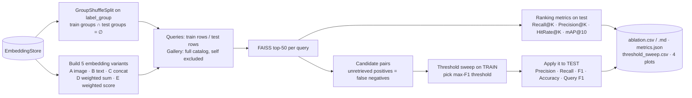

### 8. Optional training pipeline

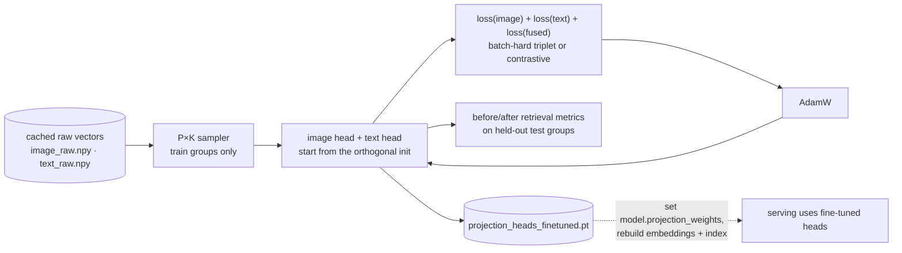

The CLIP and MiniLM backbones stay frozen. Only about 230k projection parameters
are trained, so this runs in seconds on a CPU.

### 9. Code layering

Dependencies point one way, from entry points down to utilities:

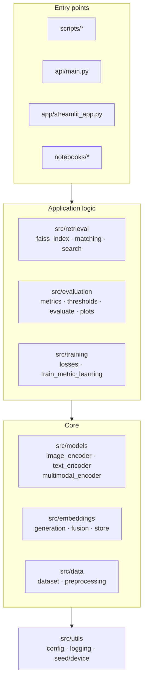

### 10. Artifact contracts and consistency

| Guarantee | How it is enforced |
|---|---|
| Row *i* of every embedding matrix is product *i* | `metadata.csv` is written with the arrays; `EmbeddingStore.load` checks row counts |
| FAISS row *i* is metadata row *i* | Indexes are built from the store in order. `manifest.json` stores a SHA-256 fingerprint of the ordered product IDs, and `load_index_set` rejects a mismatch |
| Queries are encoded in the same space as the catalog | The heads used at build time are saved as `projection_heads.pt` and loaded by `ProductSearchEngine.from_artifacts` |
| Index dimension and size are correct | `FaissIndex.load(expected_dim, expected_size)` raises `InvalidIndexError` |
| Fusion settings are consistent | The embeddings manifest records the fusion method; the engine warns if the config differs |
| Runs are reproducible | One seed drives data generation, head initialisation, splits and training; the data generator is byte-for-byte deterministic |

### 11. Configuration map

Everything tunable lives in `configs/config.yaml`, parsed into typed,
validated dataclasses (`src/utils/config.py`). Unknown keys and out-of-range
values fail at startup.

| Section | Controls | Used by |
|---|---|---|
| `model` | backbone names, projection dim, head init, optional trained heads, batch sizes | encoders, build script, training |
| `fusion` | method (`weighted_sum` / `concat`), image and text weights | encoder, search engine, evaluation |
| `retrieval` | index type, default top-k, candidate multiplier | index build, search engine |
| `matching` | global threshold and per-mode thresholds | search engine, API, UI, evaluation |
| `data` | catalog CSV, image root, title cleaning | dataset loader |
| `split` | `group_shuffle` / `group_kfold` / `random`, test size, folds | evaluation, training |
| `evaluation` | K values, candidate pool size, threshold grid | evaluation |
| `training` | loss, margin, epochs, learning rate, P×K sampling, output path | training |
| `paths` | artifact directories | all stages |

Environment overrides: `MPM_CONFIG` (config file), `MPM_DEVICE` (`cpu` / `cuda` /
`mps`), `MPM_FAISS_THREADS` (macOS FAISS threads) and `LOG_LEVEL`.

### 12. Failure handling

| Situation | Behaviour |
|---|---|
| Catalog missing, empty, lacking required columns, or with duplicate IDs | `DatasetError` with a clear message |
| Missing or corrupt image file | Warning; product kept with `has_image = False`, matched on its title |
| Empty title | Warning; product kept with `has_text = False`, matched on its image |
| Invalid config value or unknown key | `ConfigError` at startup |
| Embeddings or indexes missing, stale or corrupt | `EmbeddingStoreError` / `InvalidIndexError`. The API stays up, `/health` reports `degraded` with the reason, and the query endpoints return 503 |
| Bad upload | 400 undecodable image, 413 over 10 MB, 415 not an image |
| Bad query | 422: wrong mode, `image` mode without an image, empty title in `text` mode, `top_k` outside 1–100 |
| Unknown `product_id` | 404 |
| Concurrent requests | Models load once at startup; inference is serialised with a lock because torch models are not guaranteed thread-safe |
| GPU availability | Automatic CUDA → MPS → CPU selection; an unavailable explicit choice falls back to CPU |

---

## Design decisions

<details open>
<summary><b>Why CLIP?</b></summary>

CLIP's vision tower was trained contrastively on hundreds of millions of image–text
pairs. Its embedding space therefore clusters images by *semantic* content (object
type, colour, style) rather than by raw pixels, which is what "same product?"
needs. It works zero-shot, runs on a laptop (ViT-B/32 ≈ 87M params in the vision
tower) and can be swapped for any CLIP-family checkpoint through the config.
</details>

<details open>
<summary><b>Why Transformer sentence embeddings for titles?</b></summary>

Seller titles for one product use different word order, abbreviations and synonyms
("tee" / "t-shirt", "flask" / "bottle"). TF-IDF only matches exact tokens.
Sentence Transformers are trained for semantic similarity and handle paraphrases.
MiniLM-L6 (22M params) is small enough to run comfortably on a laptop CPU.
</details>

<details open>
<summary><b>Why L2 normalisation?</b></summary>

After normalisation, the inner product equals cosine similarity. Scores are then
bounded in [−1, 1] and comparable across products, so a single threshold means
the same thing everywhere. It also lets FAISS use an exact inner-product index for
cosine search. Fusion re-normalises too, so the fused vector stays on the unit
sphere.
</details>

<details open>
<summary><b>Why FAISS <code>IndexFlatIP</code>?</b></summary>

For unit vectors, maximum inner product = maximum cosine similarity. A flat index
is **exact** (no recall loss), needs no training and is fast up to a few hundred
thousand items on CPU. The wrapper in `src/retrieval/faiss_index.py` isolates it,
so it can later be swapped for IVF-PQ or HNSW for million-scale catalogs.
</details>

<details open>
<summary><b>Why multimodal fusion?</b></summary>

See [Why multimodal matching?](#why-multimodal-matching). The two modalities
disagree on different pairs: image similarity cannot separate colour variants
well, and titles cannot separate products with vague titles. Weighted fusion lets
each modality cover the other's blind spots. The weights are configurable, and
the ablation below measures what fusion actually buys on this data.
</details>

<details open>
<summary><b>Why group-based validation (GroupShuffleSplit / GroupKFold)?</b></summary>

All listings in one `label_group` are the same product. A random row split would
put listings of the same product on both sides. A threshold or fine-tuned head
would then be scored on products it has effectively already seen, which inflates
metrics. Splitting by `label_group` keeps every product entirely in train or
entirely in test, which mimics the real task: matching listings of **new**
products. `split.strategy` supports `group_shuffle`, `group_kfold` and (for
comparison only) `random`.
</details>

---

## Dataset format

```csv
product_id,title,image_path,category,label_group
P0001,Nordwave Cotton Tee Red Size M,sample_images/P0001.jpg,Fashion,tshirt_red
```

`product_id`, `title` and `image_path` are required. `label_group` is needed for
evaluation and training. The repository ships a **small synthetic catalog**
(144 listings, 50 groups, ~1 MB) so everything runs end to end without downloads.
See [`data/README.md`](data/README.md) for the format, how to plug in your own
catalog, and how to convert the Shopee competition data (not included).

---

## Installation

Requires Python 3.11+. Tested on macOS (Apple M2, MPS) with Python 3.12.

```bash
git clone https://github.com/techbhuvi04/Shopify.git
cd Shopify
python3 -m venv .venv
source .venv/bin/activate
pip install -r requirements.txt
```

The first run downloads the pretrained models from the Hugging Face Hub
(CLIP ViT-B/32 ≈ 600 MB, MiniLM ≈ 90 MB). No API keys are needed.

Device selection is automatic (CUDA → MPS → CPU). Override it with `device:` in the
config or the `MPM_DEVICE` environment variable. Use a different config file with
`--config path.yaml` or `MPM_CONFIG=path.yaml`.

---

## Running locally

All settings (model names, projection dim, fusion weights, thresholds, top-k,
paths, split strategy) live in [`configs/config.yaml`](configs/config.yaml).

```bash
# 0. (optional) regenerate the synthetic sample catalog. It is already committed.
python scripts/generate_sample_data.py

# 1. Build embeddings  -> artifacts/embeddings/
python scripts/build_embeddings.py

# 2. Build FAISS indexes -> artifacts/indexes/
python scripts/build_index.py

# 3. Evaluate + ablation -> artifacts/results/, artifacts/plots/
python scripts/evaluate.py

# 4. Streamlit demo -> http://localhost:8501
streamlit run app/streamlit_app.py

# 5. FastAPI service -> http://localhost:8000/docs
uvicorn api.main:app --host 0.0.0.0 --port 8000

# Tests (offline; use fake encoders, no model download)
pytest
```

On the reference machine (Apple M2), step 1 took ~30 s for 144 products,
including model loading. Steps 2–3 take a few seconds.

---

## API examples

Interactive docs: `http://localhost:8000/docs`.

```bash
# Health
curl http://localhost:8000/health
# {"status":"ok","products":144,"device":"mps","detail":null}

# Multimodal search
curl -X POST http://localhost:8000/search \
  -F image=@data/sample_images/P0020.jpg \
  -F "title=casa bella green coffee mug" \
  -F mode=multimodal -F top_k=3

# Text-only / image-only
curl -X POST http://localhost:8000/search -F "title=hydropeak water bottle" -F mode=text
curl -X POST http://localhost:8000/search -F image=@my_photo.jpg -F mode=image -F top_k=5

# Match two products: catalog IDs and/or uploads
curl -X POST http://localhost:8000/match -F product_id_a=P0003 -F product_id_b=P0004
curl -X POST http://localhost:8000/match -F product_id_a=P0003 \
  -F "title_b=Nordwave blue cotton tee" -F image_b=@data/sample_images/P0004.jpg
```

Example `/search` response (real output from the sample catalog, truncated):

```json
{
  "query": {"title": "casa bella green coffee mug", "mode": "multimodal", "has_image": true, "top_k": 3},
  "threshold": 0.85,
  "results": [
    {"rank": 1, "product_id": "P0020", "title": "New Casa Bella CA-MU117 Mug - Green",
     "image_similarity": 1.0, "text_similarity": 0.8361, "combined_similarity": 0.9344, "is_match": true},
    {"rank": 2, "product_id": "P0021", "title": "[PROMO] Coffee Cup Casa Bella Green CA-MU117 free shipping",
     "image_similarity": 0.8481, "text_similarity": 0.7834, "combined_similarity": 0.8222, "is_match": false}
  ]
}
```

P0021 is in fact the same product, but it scores 0.822, below the multimodal
threshold of 0.85. This false negative illustrates the precision/recall trade-off
that the threshold controls.

| Endpoint | Input | Notes |
|---|---|---|
| `GET /health` | – | `degraded` + reason if artifacts are missing |
| `POST /search` | multipart: `image?`, `title?`, `mode`, `top_k` (1–100) | 422 on invalid mode/inputs, 400 undecodable image, 413 > 10 MB, 415 non-image |
| `POST /match` | multipart: `image_a?`, `title_a?`, `product_id_a?`, same for `b` | 404 unknown product ID |
| `GET /products/{id}/image` | – | serves catalog images to clients |

---

## Evaluation methodology

`scripts/evaluate.py` (logic in `src/evaluation/`):

1. **Group split.** `GroupShuffleSplit` on `label_group` (seed 42, 30% of groups
   held out): 100 train and 44 test listings, with no product in both.
2. **Retrieval.** Gallery = the full catalog, queries = test listings (self
   excluded). Each query's relevant set is the other listings of its group.
   Metrics: **Recall@K** (fraction of the relevant set in the top K),
   **Precision@K**, **HitRate@K** and **mAP@10**.
3. **Matching.** Every (query, top-50 candidate) pair gets a MATCH decision.
   Relevant pairs that were never retrieved count as **false negatives**, so
   recall is not flattered by the candidate cut-off. Metrics: pairwise
   Precision / Recall / F1 / Accuracy, plus mean per-query F1 (the row-wise F1
   used by marketplace matching benchmarks).
4. **Thresholds.** A sweep over 0.50, 0.55, …, 0.95. The threshold is **selected
   on train queries** (max F1) and **reported on test queries**, so it is never
   tuned on the data it is scored on.

Note: with 2–4 listings per group, a query has 1–3 relevant items, so Recall@1 is
capped below 1.0 and Precision@K is capped at |relevant|/K by construction.

---

## Results & ablation study

All numbers below come from actually running `python scripts/evaluate.py` on the
bundled **synthetic** sample (144 listings, 50 groups, 44 held-out test queries,
seed 42, Apple M2). Re-running reproduces them. **They show that the pipeline
works and how the variants compare on this toy data. They are not an estimate of
real-world performance.** Results for a real dataset will be populated after you
run the evaluation pipeline on it.

| Experiment | Embedding | R@1 | R@5 | R@10 | mAP@10 | Thr (train) | Precision | Recall | F1 | Query F1 |
|---|---|---|---|---|---|---|---|---|---|---|
| A. Image only | CLIP → proj | **0.322** | 0.564 | 0.735 | 0.485 | 0.90 | 0.212 | 0.391 | 0.275 | 0.287 |
| B. Text only | MiniLM → proj | 0.261 | 0.723 | **0.951** | 0.551 | 0.70 | 0.302 | **0.739** | 0.429 | 0.421 |
| C. Image + Text concat | `[img, txt]` | 0.254 | **0.758** | 0.932 | 0.542 | 0.80 | 0.343 | 0.652 | **0.449** | **0.461** |
| D. Weighted fusion | `0.6·img + 0.4·txt` | 0.277 | 0.723 | 0.898 | 0.538 | 0.85 | 0.306 | 0.370 | 0.335 | 0.294 |
| E. Weighted score fusion | `[√0.6·img, √0.4·txt]` | 0.284 | 0.742 | 0.939 | **0.566** | 0.85 | **0.396** | 0.391 | 0.393 | 0.345 |

Experiment E concatenates √w-scaled modality vectors. Its inner product equals
`0.6·sim_img + 0.4·sim_txt` exactly, which is the combined score that
`/search` and `/match` use. D is the literal "sum then normalise" fusion from the
architecture diagram.

**What the numbers say (honestly):**

- Fusion variants give the best **mAP@10** (E: 0.566) and **R@5** (C: 0.758),
  but the gains over text-only are small on this data.
- **Text is the stronger single modality** here. The synthetic images are simple
  drawings, and colour variants of one product type look alike to CLIP. Image-only
  is best at R@1 but weakest overall.
- **D < C and E.** Summing vectors from two different embedding spaces adds
  meaningless cross-modal cross terms. Concatenation (C/E) keeps the modalities
  separate. This is an argument for score-level fusion, which the engine uses for
  ranking and matching.
- Match F1 stays below 0.5 for every variant with frozen, general-purpose
  encoders. The hardest cases are same-brand colour variants (see notebook 03).
  This is what the metric-learning module targets.

<p align="center">
  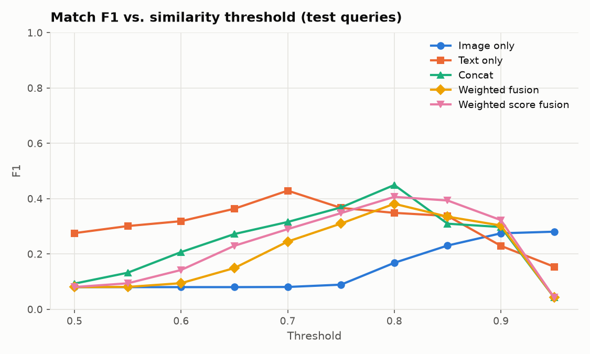
  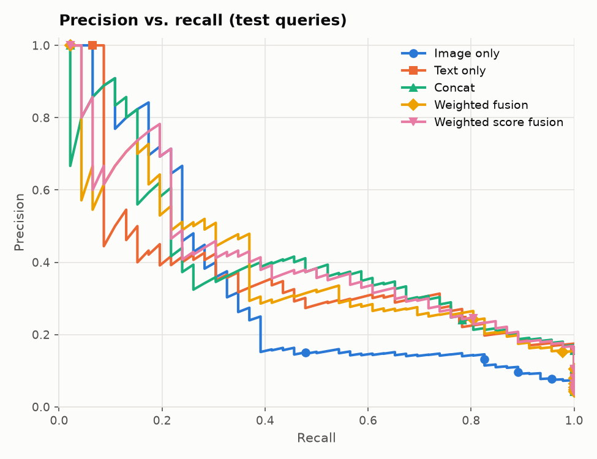
</p>
<p align="center">
  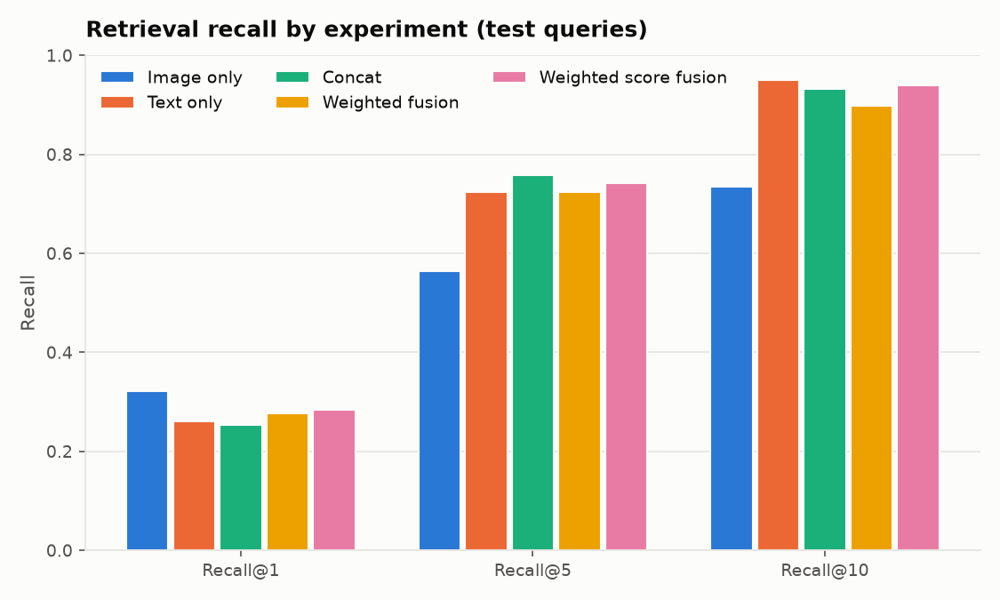
  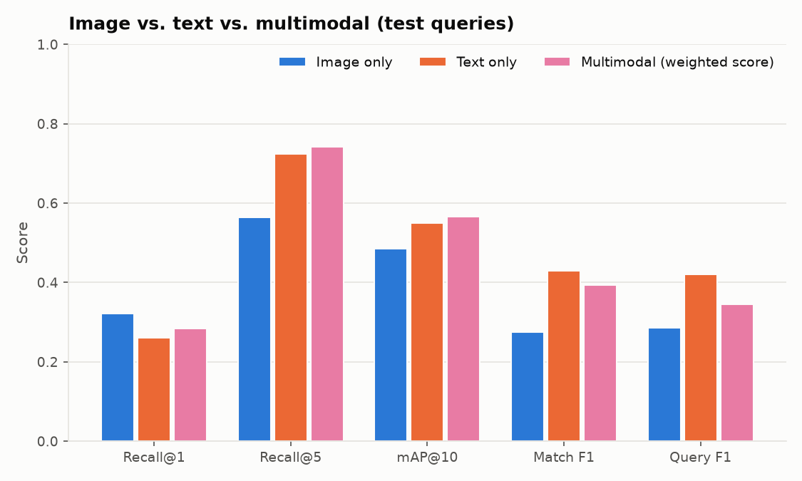
</p>

Outputs: `artifacts/results/ablation.{csv,md}`, `threshold_sweep.csv`, `metrics.json`
and `artifacts/plots/*.png`. The per-mode thresholds in `config.yaml`
(`image 0.90 / text 0.70 / multimodal 0.85`) are the train-split selections above.
Re-tune them for a new dataset.

---

## Optional: metric learning

The baseline needs no training. `src/training/` shows how to adapt it cheaply:
the backbones stay **frozen** (their cached embeddings are reused), and only the
two projection heads (~230k parameters) are trained with a **batch-hard
triplet loss** or a **contrastive loss**. Batches use P×K group sampling, and
training uses train-split groups only.

```bash
python -m src.training.train_metric_learning      # < 1 s on CPU for the sample
```

To use the heads, set `model.projection_weights: artifacts/models/projection_heads_finetuned.pt`
in the config, then rerun `build_embeddings.py`, `build_index.py` and `evaluate.py`.

Measured on the 44 held-out test queries (groups never seen in training):

| Modality | Recall@1 (before → after) | Recall@5 | mAP@10 |
|---|---|---|---|
| Image | 0.322 → 0.545 | 0.564 → 1.000 | 0.485 → 0.997 |
| Text | 0.261 → 0.545 | 0.723 → 0.989 | 0.551 → 0.985 |
| Multimodal | 0.284 → 0.545 | 0.742 → 1.000 | 0.566 → 1.000 |

With the fine-tuned heads, test match F1 at the train-tuned threshold rose to
0.81 for weighted score fusion and 0.94 for concat.

> ⚠️ **Read this with care.** The synthetic catalog has only 10 product types × 5
> colours. Held-out groups are new *combinations* of types, colours and brands
> that training has already seen, so generalising is much easier than on a real
> marketplace. The near-perfect numbers show that the training loop works. They
> do **not** predict real-world gains. (Recall@1 = 0.545 is the ceiling, because
> most queries have more than one relevant listing.)

---

## Project structure

```
Shopify/
├── api/main.py                         FastAPI service (lifespan-loaded engine, validation)
├── app/streamlit_app.py                Streamlit UI: search, pairwise match, evaluation tabs
├── configs/config.yaml                 single source of truth for all settings
├── data/                               synthetic sample catalog + data README
├── docs/images/                        evaluation plots used in this README
├── notebooks/                          01 data · 02 image emb · 03 text emb · 04 retrieval/eval
├── scripts/
│   ├── generate_sample_data.py         deterministic synthetic catalog
│   ├── build_embeddings.py             catalog → raw + projected + fused embeddings
│   ├── build_index.py                  embeddings → FAISS indexes + manifest
│   └── evaluate.py                     retrieval, matching, thresholds, ablation, plots
├── src/
│   ├── data/                           CSV validation, title cleaning, safe image loading, group splits
│   ├── models/                         CLIP image encoder, sentence text encoder, projection heads + MultimodalEncoder
│   ├── embeddings/                     batch generation, fusion, on-disk EmbeddingStore
│   ├── retrieval/                      FAISS wrapper, pair matching, ProductSearchEngine
│   ├── evaluation/                     metrics, threshold analysis, ablation runner, plots
│   ├── training/                       triplet/contrastive losses, projection-head fine-tuning
│   └── utils/                          typed config, logging, seeding + device detection
├── tests/                              54 offline tests (fake encoders, full mini-pipeline, API)
└── artifacts/                          generated outputs (gitignored)
```

---

## Screenshots

> _Placeholder: add screenshots after running the apps locally._
>
> - `docs/images/streamlit_search.png`: Streamlit search results grid
> - `docs/images/streamlit_match.png`: pairwise match view
> - `docs/images/api_docs.png`: FastAPI `/docs`

---

## Limitations

- **Synthetic demo data.** The bundled results say nothing about real-world
  accuracy. Evaluate on a real catalog before drawing conclusions.
- **Frozen general-purpose encoders.** CLIP and MiniLM are not specialised for
  product identity. Colour and variant differences are the main failure mode.
- **Global fusion weights.** One `(w_i, w_t)` pair for all categories. The best
  balance likely differs by category and by title quality.
- **Coarse threshold grid** (0.05 steps), selected on a small train split.
- **Exact flat index.** Fine up to ~10⁵–10⁶ items. Larger catalogs need an ANN
  index (IVF-PQ / HNSW).
- **English-centric text model.** Multilingual marketplaces need a multilingual
  encoder, for example `paraphrase-multilingual-MiniLM-L12-v2`.
- **macOS note.** The torch and faiss-cpu macOS wheels each bundle `libomp`.
  `src/__init__.py` applies the known workaround (load torch first, single-threaded
  FAISS). Set `MPM_FAISS_THREADS` to change the thread count.

## Future improvements

- Fine-tune the backbones (not just the heads) with ArcFace or sub-center ArcFace
  on real `label_group` data.
- Learn fusion weights, or a small cross-modal re-ranker, on validation pairs.
- Add a TF-IDF / character n-gram channel for model codes and SKUs, which dense
  encoders blur.
- Query expansion / neighbourhood re-ranking (e.g. α-QE) and graph-based grouping
  of matches.
- ANN indexes with recall/latency benchmarks, and incremental index updates.
- Experiment tracking (MLflow / W&B) and a Docker image for the API.

---

## License

MIT. See [LICENSE](LICENSE). Pretrained models are subject to their own licences
on the Hugging Face Hub.
